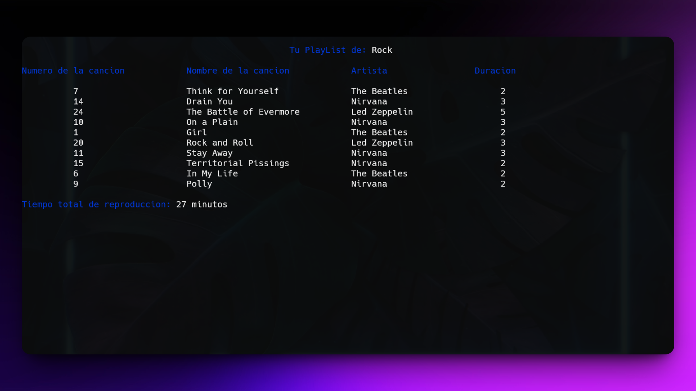

<h1 align="center">Music Player System in C/C++ 🎵</h1>
<p align="left">
  <a href="README_ES.md" target="_blank">
    Ver README en Español
  </a>
</p>
<p>This repository contains the source code and related files of my final project for the Programming Lab 2 course. The project is a console-based music player system that allows users to select a music genre and receive a randomly generated playlist based on their selection. The main objective of this project was to apply advanced programming concepts, such as file handling, data structuring with structs, queue-based logic, and input validations to simulate the experience of a basic yet functional music player.</p>
<h1 align="center">Technologies Used</h1>
<div align="center">
  
  
</div>
<hr>
<h1 align="center">Objective</h1>
<ul>
  <li>Build a complete music player simulator from scratch.</li>
  <li>Practice file input/output for data persistence.</li>
  <li>Implement queue logic for ordered playlist playback.</li>
  <li>Use structs for clean data modeling and modular programming.</li>
  <li>Apply solid input validation to enhance user experience.</li>
</ul>
<hr>
<h1 align="center">Main Features</h1>
<ul>
  <li><b>Advanced Array Manipulation:</b> Stores and retrieves albums and songs from .txt files. Playlists are dynamically built from these files based on user input.</li>
  <li><b>Struct-based Organization:</b> Models genres, albums, and songs using structs, ensuring clean and modular code.</li>
  <li><b>Queue Implementation:</b> A custom queue structure is used to manage playlist order and simulate realistic playback behavior.</li>
  <li><b>Robust Input Validation:</b> Avoids duplicate genre selections and ensures that all inputs follow expected formats and constraints.</li>
  <li><b>Random Playlist Generator:</b> Automatically creates a random playlist based on the chosen genre for a more dynamic experience.</li>
</ul>
<hr>
<h1 align="center">Skills Acquired</h1>
<ul>
  <li>Intermediate to advanced programming in <b>C/C++</b></li>
  <li>Understanding and implementing <b>file operations</b></li>
  <li>Mastery of <b>custom data structures</b> like queues</li>
  <li>Clean and efficient use of structs for data management</li>
  <li>Better grasp of <b>terminal-based user interface logic</b></li>
</ul>
<hr>

### How to Use

1. Clone this repository to your local machine:

   ```sh
   git clone https://github.com/jordanmedinaortiz/music-player-c.git
   cd music-player-c.git
   ```

2. Compile the program using GCC or any compatible C compiler:
   ```sh
   gcc ReproduccionMusical.c -o ReproduccionMusical
   ```

3. Run the program:
   ```sh
   ./ReproduccionMusical
   ```
4. Select your music genre

5. Enjoy your playlist

<p>This music player was developed individually as part of my final project for the Programming Lab 2 course. It helped me reinforce my understanding of file systems, data structures, and user interaction in C/C++. It’s a great foundation for future music-related or queue-based systems I might build.</p>

