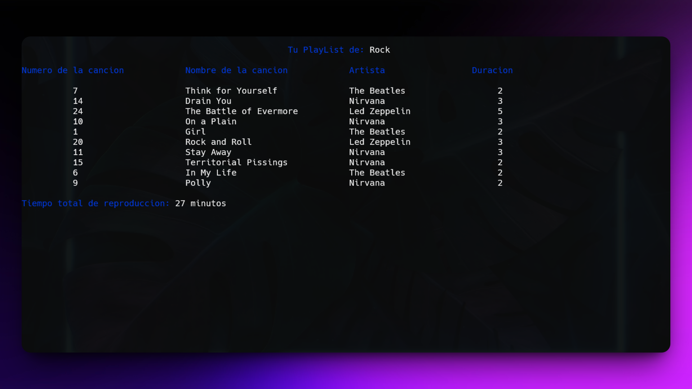

<h1 align="center">Sistema Reproductor de Música en C/C++ 🎵</h1>

<p align="left">
  <a href="README.md" target="_blank" style="
    display: inline-block;
    background-color: #00247D;
    color: white;
    padding: 8px 16px;
    border-radius: 8px;
    text-decoration: none;
    font-weight: bold;
    font-family: sans-serif;
    box-shadow: 0 2px 6px rgba(0,0,0,0.15);
    transition: background-color 0.3s;
  " onmouseover="this.style.backgroundColor='#003EB3'" onmouseout="this.style.backgroundColor='#00247D'">
    🇬🇧 View README in English
  </a>
</p>

<p>Este repositorio contiene el código fuente y los archivos relacionados de mi proyecto final para el curso de Laboratorio de Programación 2. El proyecto es un sistema de reproductor de música basado en consola que permite al usuario seleccionar un género musical y recibir una lista de reproducción generada aleatoriamente según su elección. El objetivo principal fue aplicar conceptos avanzados de programación como manejo de archivos, estructuración de datos con `structs`, lógica basada en colas y validación de entradas para simular la experiencia de un reproductor funcional y básico.</p>

<h1 align="center">Tecnologías Utilizadas</h1>
<div align="center">
  
  
</div>
<hr>

<h1 align="center">Objetivo</h1>
<ul>
  <li>Construir un simulador de reproductor de música desde cero.</li>
  <li>Practicar entrada/salida de archivos para persistencia de datos.</li>
  <li>Implementar lógica de colas para reproducción ordenada de listas.</li>
  <li>Usar `structs` para modelado limpio de datos y programación modular.</li>
  <li>Aplicar validación sólida de entradas para mejorar la experiencia del usuario.</li>
</ul>
<hr>

<h1 align="center">Características Principales</h1>
<ul>
  <li><b>Manipulación avanzada de arreglos:</b> Almacena y recupera álbumes y canciones desde archivos `.txt`. Las playlists se construyen dinámicamente según la selección del usuario.</li>
  <li><b>Organización basada en structs:</b> Modela géneros, álbumes y canciones usando estructuras para asegurar un código limpio y modular.</li>
  <li><b>Implementación de cola personalizada:</b> Se utiliza una estructura de cola personalizada para gestionar el orden de la lista de reproducción y simular una reproducción realista.</li>
  <li><b>Validación robusta de entradas:</b> Evita selecciones duplicadas de géneros y asegura que todas las entradas cumplan con formatos y restricciones esperadas.</li>
  <li><b>Generador aleatorio de playlist:</b> Crea automáticamente una lista aleatoria según el género elegido para una experiencia más dinámica.</li>
</ul>
<hr>

<h1 align="center">Habilidades Adquiridas</h1>
<ul>
  <li>Programación de nivel intermedio a avanzado en <b>C/C++</b></li>
  <li>Comprensión e implementación de <b>operaciones con archivos</b></li>
  <li>Dominio de <b>estructuras de datos personalizadas</b> como colas</li>
  <li>Uso limpio y eficiente de `structs` para gestión de datos</li>
  <li>Mejor comprensión de <b>interfaces basadas en terminal</b></li>
</ul>
<hr>

### Cómo Usar

1. Clona este repositorio en tu máquina local:

   ```sh
   git clone https://github.com/jordanmedinaortiz/music-player-c.git
   cd music-player-c.git
2. Compila el programa usando GCC o cualquier compilador compatible con C:
   ```sh
   gcc ReproduccionMusical.c -o ReproduccionMusical
   ```

3. Ejecuta el programa:
   ```sh
   ./ReproduccionMusical
   ```
4. Selecciona tu género musical

5. Disfruta tu playlist 🎶

<p>Este reproductor fue desarrollado de forma individual como parte de mi proyecto final para el curso de Laboratorio de Programación 2. Me permitió reforzar conocimientos sobre sistemas de archivos, estructuras de datos y lógica de interacción con el usuario en C/C++. Representa una gran base para futuros proyectos relacionados con música o sistemas basados en colas.</p>

